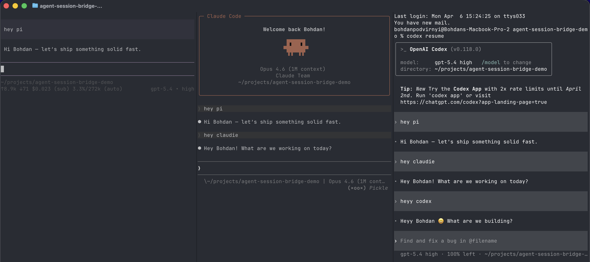

# Agent Session Bridge

[](https://github.com/bohdanpodvirnyi/agent-session-bridge/actions/workflows/ci.yml)
[](./LICENSE)
[](https://www.npmjs.com/package/agent-session-bridge)

Local-first session portability for Pi, Claude Code, and Codex.

`agent-session-bridge` mirrors resumable conversations between the three local coding agents so you can start in one tool, switch tools in the same folder, and keep going from the same thread.



https://github.com/user-attachments/assets/d1b151a4-78e9-42ef-98ee-bb5045809f51

## Why

Each agent stores sessions in a different place and in a different format:

- Pi uses session trees in `~/.pi/agent/sessions`
- Claude Code uses JSONL transcripts in `~/.claude/projects`
- Codex uses rollout event logs in `~/.codex/sessions`

This project sits between them and keeps those local stores in sync.

The goal is simple:

1. talk to Pi in a repo
2. open Claude Code or Codex in that same repo
3. resume the same conversation instead of starting over

## What Makes It Different

This repo is not a session viewer, a skills sync, or a live agent-to-agent bridge.

It is focused on one job:

- parse native session formats
- convert them into the other tools' native formats
- keep replay-safe mirror state on disk
- repair older imported sessions when history got messy

The distinctive angle is `local-first durability`.

- The bridge writes directly into each tool's own session store.
- The CLI installs self-contained runtime assets into `~/.agent-session-bridge/runtime`.
- Sync, repair, and validation are all built around real local agent behavior.

## Install

Public npm install:

```bash
npx agent-session-bridge setup
npx agent-session-bridge doctor
```

Or install globally:

```bash
npm install -g agent-session-bridge
agent-session-bridge setup
agent-session-bridge doctor
```

Tarball flow also works if you want to test an unpublished local build:

```bash
npm pack
npx --yes --package ./agent-session-bridge-0.1.0.tgz agent-session-bridge setup
npx --yes --package ./agent-session-bridge-0.1.0.tgz agent-session-bridge doctor
```

Local checkout flow:

```bash
git clone https://github.com/bohdanpodvirnyi/agent-session-bridge.git
cd agent-session-bridge

pnpm install
pnpm build
node packages/cli/dist/cli/src/index.js setup
node packages/cli/dist/cli/src/index.js doctor
```

## CLI

Main commands:

- `setup`: install Pi, Claude Code, and Codex integration for the current repo
- `enable`: enable sync for the current repo or globally
- `doctor`: inspect install health, project scope, and recent hook activity
- `repair`: repair imported Pi or Claude sessions for the current repo
- `import`: import latest or all foreign sessions into selected target tools
- `list`: show registry conversations
- `audit`: dump the local bridge registry

Examples:

```bash
agent-session-bridge setup
agent-session-bridge enable --global
agent-session-bridge doctor
agent-session-bridge repair
agent-session-bridge import --tool codex --all
```

## How It Works

At a high level:

1. detect a source session from Pi, Claude Code, or Codex
2. normalize it into a shared internal message model
3. write compatible mirror entries into the target tool stores
4. track offsets and mirror identities in a local registry
5. prevent replay loops and repair malformed historical imports

Runtime state lives under:

- `~/.agent-session-bridge/config.json`
- `~/.agent-session-bridge/registry.json`
- `~/.agent-session-bridge/runtime/`

## Repo Layout

Top-level packages:

- `packages/core`: parsers, converters, registry, config, sync, dedupe, repair helpers
- `packages/cli`: install, doctor, import, repair, audit, and setup commands
- `packages/pi`: Pi integration surface
- `packages/claude-code`: Claude Code integration surface
- `packages/codex`: Codex integration surface
- `packages/daemon`: optional backfill and filesystem-driven helpers

Reference material:

- [examples/config/global.json](./examples/config/global.json)
- [examples/config/project-allowlist.json](./examples/config/project-allowlist.json)
- [examples/flows/three-agent-loop.md](./examples/flows/three-agent-loop.md)
- [docs/ARCHITECTURE.md](./docs/ARCHITECTURE.md)
- [docs/HOOKS.md](./docs/HOOKS.md)
- [docs/TROUBLESHOOTING.md](./docs/TROUBLESHOOTING.md)
- [TESTING.md](./TESTING.md)
- [CONTRIBUTING.md](./CONTRIBUTING.md)

## Validation

This repo includes:

- parser and converter unit tests
- file-level end-to-end coverage
- temp-home integration tests
- real-command E2E coverage against installed `pi`, `claude`, and `codex`

Run the standard suite:

```bash
pnpm test
pnpm typecheck
pnpm fixture:validate
pnpm exec prettier --check .
```

Run the real-agent suite:

```bash
pnpm test:real-agents
```

## Examples

Config examples live in [examples/config](./examples/config).

The demo loop in [examples/flows/three-agent-loop.md](./examples/flows/three-agent-loop.md) shows the intended flow:

1. start a conversation in Pi
2. resume it in Claude Code
3. continue it in Codex
4. come back to Pi and keep going

## Current Limitations

- Older imported transcripts can still need `repair` if they were created by earlier bridge versions.
- Some legacy Codex imports can still emit orphan-output warnings during resume.
- Public API and config shape may still evolve as the project hardens.
